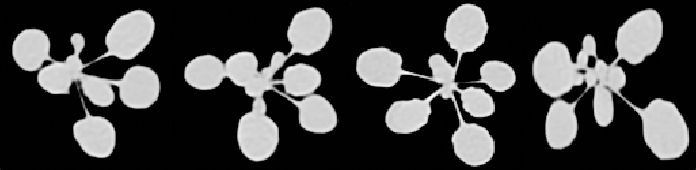

Semantic segmentation refers to the task of assigning a label to each pixel in the image. This can be used, for example, to segment organs from a plant by using the labelling as a segmentation mask. Although it may be overkill compared to standard thresholding indices, it can also be used to segment plants from the background as in this example, which is the basis of the [vegetation segmentation tool](Tools.md).



DPP provides the option to use fully convolutional networks in order to perform the semantic segmentation task. As of now, only binary segmentations are supported (pixels are assigned a number between 1 and 0, which can be rounded or thresholded to get a mask).

## Example

Here is a simple fully convolutional network for binary segmentation of images.

```python
import deepplantphenomics as dpp

model = dpp.SemanticSegmentationModel(debug=True, save_checkpoints=False, report_rate=20)

# 3 channels for colour, 1 channel for greyscale
channels = 3

# Setup and hyper-parameters
model.set_batch_size(4)
model.set_image_dimensions(256, 256, channels)
model.set_resize_images(True)

model.set_test_split(0.2)
model.set_validation_split(0.0)
model.set_learning_rate(0.0001)
model.set_weight_initializer('normal')
model.set_maximum_training_epochs(100)

# Augmentation options
model.set_augmentation_brightness_and_contrast(True)

# Load dataset
model.load_dataset_from_directory_with_segmentation_masks('./data', './segmented')

# Define a model architecture
model.add_input_layer()

model.add_convolutional_layer(filter_dimension=[3, 3, channels, 16], stride_length=1, activation_function='relu')
model.add_convolutional_layer(filter_dimension=[3, 3, 16, 32], stride_length=1, activation_function='relu')
model.add_convolutional_layer(filter_dimension=[5, 5, 32, 32], stride_length=1, activation_function='relu')

model.add_output_layer()

# Begin training the segmentation model
model.begin_training()
```

The crucial part here is that you create a `SemanticSegmentationModel` specifically. This will automatically make the output layer into a convolutional layer, which is what you need to output masks instead of scalar values. Also important is the use of ``model.load_dataset_from_directory_with_segmentation_masks()``, which loads binary images of ground-truth segmentations as the labels, instead of something like numbers from a csv file. These ground-truth images are `.png` files, with the value 0 in every channel for negative pixels, and the value 255 in every channel for positive pixels.

The only augmentation strategy currently compatible with fully convolutional networks is the brightness and contrast option.

## Generating and Applying the Segmentation Mask

Since the fully connected output is a one-channel greyscale image, it must be rounded or thresholded to get a binary segmentation mask. The [vegetation segmentation tool](Tools.md) does this using the Otsu thresholding method in OpenCV.

Since the size of the output layer cannot change, the masks are always output in the same dimensions. This means that the mask must be resized to the same width and height as the original image before being applied. See the [vegetation segmentation tool](Tools.md) for an example of how to do this.
