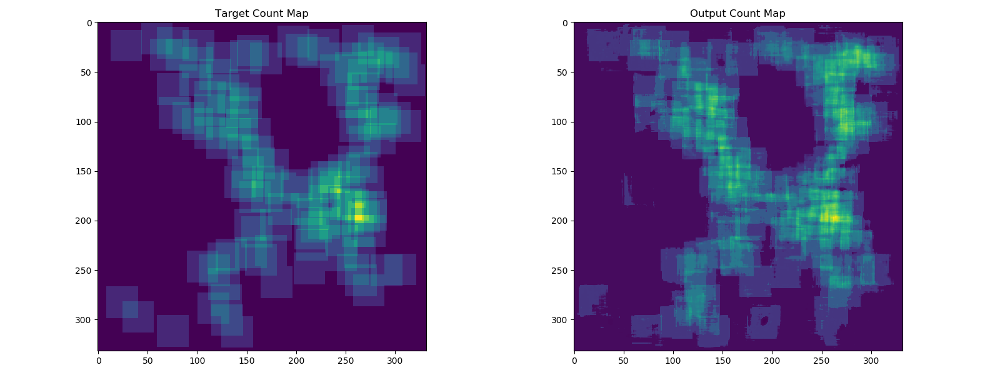

DPP provides two different techniques that can be used for object counting. One of those models is the [Count-ception object counter](https://arxiv.org/abs/1703.08710), which is useful for tasks like counting dense canola flowers. It does so by producing maps of redundant counts and processing them into a single object count.



The structure and process of setting up and training a model is similar to other DPP models (see the [Leaf Counter training tutorial](Tutorial-Training-The-Leaf-Counter.md) for a detailed description of this). This covers the differences in model setup and data/label loading specific to training a Countception model in DPP.

## Full Example

Below is a working example of training a Countception object counter in DPP. 

```python
#
# Demonstrates the process of training a Countception object counter in DPP.
#

import deepplantphenomics as dpp

model = dpp.CountCeptionModel(debug=True, save_checkpoints=False, report_rate=20)

# Setup and hyperparameters
model.set_loss_function('l1')
model.set_batch_size(2)
model.set_image_dimensions(300, 300, 3)

model.set_test_split(0.2)
model.set_validation_split(0.1)
model.set_learning_rate(0.0001)
model.set_maximum_training_epochs(1000)

# Load images and ground truth from a pickle file
model.load_countception_dataset_from_pkl_file('MBM-dataset.pkl')

# Define the countception model architecture
model.use_predefined_model('countception')

# Begin training the countception model
model.begin_training()
```

## Count-ception Network Layers (Advanced)

The Countception network consists of six convolutional layers and six parallel convolutional blocks. The Count-ception network can be recreated with the following layers:

```python
patch_size = 32
model.add_input_layer()
model.add_convolutional_layer([3, 3, 3, 64], 1, 'lrelu', patch_size, True, 1e-5, 0.9)
model.add_paral_conv_block([1, 1, 0, 16], [3, 3, 0, 16])
model.add_paral_conv_block([1, 1, 0, 16], [3, 3, 0, 32])
model.add_convolutional_layer([14, 14, 0, 16], 1, 'lrelu', 0, True, 1e-5, 0.9)
model.add_paral_conv_block([1, 1, 0, 112], [3, 3, 0, 48])
model.add_paral_conv_block([1, 1, 0, 64], [3, 3, 0, 32])
model.add_paral_conv_block([1, 1, 0, 40], [3, 3, 0, 40])
model.add_paral_conv_block([1, 1, 0, 32], [3, 3, 0, 96])
model.add_convolutional_layer([18, 18, 0, 32], 1, 'lrelu', 0, True, 1e-5, 0.9)
model.add_convolutional_layer([1, 1, 0, 64], 1, 'lrelu', 0, True, 1e-5, 0.9)
model.add_convolutional_layer([1, 1, 0, 64], 1, 'lrelu', 0, True, 1e-5, 0.9)
model.add_convolutional_layer([1, 1, 0, 1], 1, 'lrelu', 0, True, 1e-5, 0.9)
```
Different from convolutional layers used in other networks, Countception follows each convolutional layer by a batch normalization layer. The last three parameters of add_convolutional_layer() method are used for setting up these batch normalization layers.

```python
add_convolutional_layer(filter_dimension, stride_length, activation_function,
                        padding=None, batch_norm=False, epsilon=1e-5, decay=0.9)
```
In the current implementation in DPP, a receptive field of 32 is used. For this setting, the first convolutional layer uses a 3x3 filter with `padding=32`, the second convolutional layer uses a 14x14 filter with `padding=0` and the third convolutional layer uses a 18x18 filter with `padding=0`. To use other receptive fields, these parameters should be modified and set properly. Each convolutional layer uses `xavier` weight initialization and the `LeakyReLu` activation function.

## Predefined Count-ception Network

While the network layers were described above, the Count-ception network (with default parameters) is available as a predefined model in DPP. After configuring the model settings and loading in the dataset, the model layers can be setup using:

```python
model.use_predefined_model('countception')
```

## Data/Label Loading

For the Countception network, image and ground truth data are loaded from a pickle file using:

```python
model.load_countception_dataset_from_pkl_file()
```

For more information about how the pickle file is generated, please refer to the [paper](https://arxiv.org/abs/1703.08710) and the [github repo](https://github.com/roggirg/count-ception_mbm).
