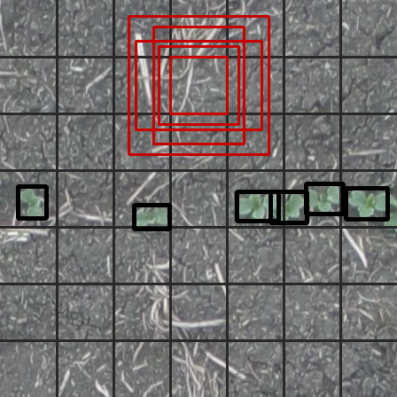

Among the kinds of tasks DPP can train models for, it can be used to train a single-class object detector. The object detection in DPP is based on the YOLO object detector ([YOLOv2 specifically](https://arxiv.org/pdf/1612.08242.pdf)). YOLO's methodology splits images into grids and makes multiple bounding box predictions in each grid square alongside a prediction for whether there is an object and what kind of object it is (in multi-class detectors).

The overall structure and process of setting up and training a model is similar to other DPP models (see the [Leaf Counter training tutorial](Tutorial-Training-The-Leaf-Counter.md) for a detailed description of this). This tutorial largely covers the differences in model setup and data/label loading specific to training YOLO object detectors in DPP.

## Full Example

Below is a working example of training an object detection model in DPP. This is a minimum model which uses all of the pre-set defaults included in the package.

```python
#
# Demonstrates the process of training a YOLO-based object detector in DPP.
#

import deepplantphenomics as dpp

model = dpp.ObjectDetectionModel(debug=True, save_checkpoints=False, report_rate=20)

# Setup and hyperparameters
model.set_image_dimensions(448, 448, 3)
model.set_resize_images(False)
model.set_patch_size(448, 448)

# model.set_yolo_parameters() is not called here because we are using all of the default values
model.set_test_split(0.1)
model.set_validation_split(0)
model.set_maximum_training_epochs(100)

model.load_yolo_dataset_from_directory('./yolo_data', label_file='labels.json', image_dir='images')

# Define the YOLOv2 model architecture
model.use_predefined_model('yolov2')

# Begin training the YOLOv2 model
model.begin_training()
```

## YOLO v2 Network Layers

Rather than having to create the layers yourself, the YOLO v2 network is available as a predefined model in DPP. After configuring the model settings and loading in the dataset, the model layers can be setup using:

```python
model.use_predefined_model('yolov2')
```

## YOLO Object Detector Settings

When training a YOLO object detector, the settings and hyperparameters will typically look like this: 

```python
# YOLO-specific setup
prior_boxes = [[159, 157], [103, 133], [91, 89], [64, 65], [142, 101]]
model.set_yolo_parameters(grid_size=[7,7],
                          labels=['plant'],
                          anchors=prior_boxes)
```

`set_yolo_parameters()` is used to set most of the settings specific to YOLO object detection. The grid size that it uses (typically with the same, odd,  width & height) and a list of the classes/labels have to be provided. YOLO also requires a list of anchors/priors for each bounding box; these are the widths and heights of reference boxes that allow the multiple bounding box predictions to detect objects of various sizes and aspect ratios.

The image below shows what some of these settings look like. The red boxes illustrate the default anchor boxes relative to a grid square. The black boxes, meanwhile, show example label boxes: these are read in as `(x_min, y_min), (x_max, y_max)` format but are internally stored `x_centre, y_centre, width, height` relative to the whole image and are returned from the network in a similar format relative to the grid square the box centre resides in.



The YOLO specific parameters default to a grid size of 7x7, a single 'plant' label, and anchors of [[159, 157], [103, 133], [91, 89], [64, 65], [142, 101]]. These settings are typical for most cases, and calling `set_yolo_parameters` is optional if all of these are left at their default values.

## Data/Label Loading

The main change for loading images and labels for YOLO object detection is that the labels need to be converted to a format with a similar box and prediction encoding to YOLO's output. This conversion happens automatically so long as the `ObjectDetectionModel` is being used and certain functions are used to load in the images and labels.

Loaders with automatic conversion to YOLO labels include:

- `load_ippn_tray_dataset_from_directory(dirname)`: Load IPPN tray images and labels and convert the labels to YOLO format.
- `load_pascal_voc_labels_from_directory(dirname)`: Load Pascal VOC labels from a directory of XML files and convert them to YOLO format. Images should then be loaded with `load_images_with_id_from_directory(dirname)`.
- `load_json_labels_from_file(filename)`: Load labels from a JSON file and convert them to YOLO format. Images should then be loaded with `load_images_from_list(files)`. See the documentation for [`load_json_labels_from_file`](Loaders.md) for the expected JSON format.
- `load_yolo_dataset_from_directory(dirname, label_file, image_dir)`: A short-hand form of the previous option, but possibly generates patches from the dataset (or loads previously generated patches).

## Automatic Patching of Large Images

Object detection also has special support for automatically splitting large input images into smaller patches of the right size when they're loaded with `load_yolo_dataset_from_directory`. This requires extra settings in the model for turning off image resizing and setting the size of the image patches.

```python
model.set_resize_images(False)
model.set_patch_size(448, 448)
```

With those settings, the labels should then be in a JSON file compatible with `load_json_labels_from_file`. `load_yolo_dataset_from_directory` will then automatically patch the input images, save them for later use, and convert the patch labels to YOLO format. The image patches and a JSON labels file will be saved in `tmp_train` in the data directory given to it, which it can reuse in order to perform this process only once on a given dataset.
