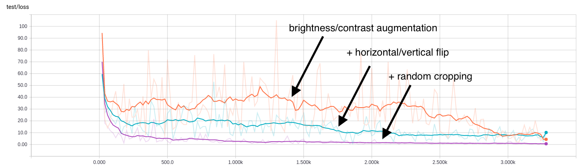

One of the functions provided in the `tools` class is `tools.estimate_rosette_leaf_count()`. This implements a pre-trained convolutional neural network (which is accessible directly at `networks.rosetteLeafRegressor()`) to count the number of leaves on a rosette-type plant.

This guide reviews the basic process which was used to train the regression model to perform this leaf-counting task. It is intended to help users who wish to train their own models for similar tasks. The full code for this model appears in the `models/leaf_counter_regressor.py` source file.

## Gathering the Training Data

The data used to train the leaf counter comes from the [IPPN dataset](http://www.plant-phenotyping.org/datasets-home) of top-view arabidopsis rosette images. These images come with a CSV file called `Leaf_counts.csv` which provides the ground-truth number of leaves corresponding to each image.

## Setting Up Model Parameters

Let's break down the setup of our model. See the documentation on model options for more information about these settings.

```python
import deepplantphenomics as dpp

model = dpp.DPPModel(debug=True, save_checkpoints=False, tensorboard_dir='/home/user/tensorlogs', report_rate=20)
```

These lines import the DPP library and start a new model. We specify `debug=True` to see console output, `save_checkpoints=False` prevents the saving of checkpoints during training (it will still save the model at the end), and `tensorboard_dir` specifies the location to write [Tensorboard](https://www.tensorflow.org/how_tos/summaries_and_tensorboard/) accumulators so we can visualize the training process. `report_rate=20` means that we will report results for one training batch and one testing batch every 20 batches.

```python
# 3 channels for colour, 1 channel for greyscale
channels = 3

# Setup and hyperparameters
model.set_batch_size(4)
model.set_number_of_threads(8)
model.set_image_dimensions(128, 128, channels)
model.set_resize_images(True)
```

These lines tell us about the input images. In this case, we are going to use batches of 4 examples for each iteration of training (since this is a very small dataset). We are going to use 8 threads for each Tensorflow input producer. This is useful if a single producer thread can't keep up with the GPU. It normally doesn't matter, but we're training on a machine with a lot of cores so why not use them?

Since the size of images varies in this dataset, we are going to choose to resize them to 128x128. We could also choose to resize them by cropping or padding instead.

```python
model.set_problem_type('regression')
model.set_num_regression_outputs(1)
model.set_train_test_split(0.8)
model.set_learning_rate(0.0001)
model.set_weight_initializer('xavier')
model.set_maximum_training_epochs(500)
```

These are hyperparameters to use for training. The first two lines specify that we are doing a regression problem (trying to estimate a number), with one output (the number of leaves).

We are going to use 80% of the examples for training, and 20% for testing. We are not using any regularization. We will use an initial learning rate of 0.0001. We are going to initialize our layer weights using the Xavier (Glorot) initialization scheme.

We will train until 500 epochs - i.e. until we have seen all of the examples in the training set 500 times.

## Specifying Augmentation Options

Since the size of the dataset is extremely small (165 images), it is necessary to use data augmentation. This means that we are going to artificially expand the size of the dataset by applying random distortions to some of the training images. The augmentations we are going to use are: randomly skewing the brightness and/or contrast, randomly flipping the images horizontally and/or vertically, and applying a random crop to the images.

The brightness/contrast augmentations are probably not needed as all of the images are taken under the same scene conditions, but it may help the trained network generalize to other datasets.

```python
# Augmentation options
model.set_augmentation_brightness_and_contrast(True)
model.set_augmentation_flip_horizontal(True)
model.set_augmentation_flip_vertical(True)
model.set_augmentation_crop(True)
```

At test time, the images will be cropped to center in order to maintain the same input size. To illustrate the importance of data augmentation, here are test regression loss results showing the difference adding each augmentation makes:



## Loading the Data

A function is included specifically for loading the data for this task.

```python
# Load all data for IPPN leaf counting dataset
model.load_ippn_leaf_count_dataset_from_directory('./data/Ara2013-Canon')
```

For other tasks, your own images and labels can be loaded via loaders for directories and CSV files. For example, if you had your images in a directory called `data` and a CSV file `data/my_labels.csv` where the first column is the filename and the second column is the number of leaves, you could do this instead:

```python
# ALTERNATIVELY - Load labels and images
model.load_multiple_labels_from_csv('./data/my_labels.csv', id_column=0)
model.load_images_with_ids_from_directory('./data')
```

## Building the Network Architecture

We are going to use a small convolutional neural network for this task. It is comprised of four convolutional layers. There are no fully connected layers except the output layer. Each convolutional layer is followed by a pooling layer.

```python
# Define a model architecture
model.add_input_layer()

model.add_convolutional_layer(filter_dimension=[5, 5, channels, 32], stride_length=1, activation_function='tanh')
model.add_pooling_layer(kernel_size=3, stride_length=2)

model.add_convolutional_layer(filter_dimension=[5, 5, 32, 64], stride_length=1, activation_function='tanh')
model.add_pooling_layer(kernel_size=3, stride_length=2)

model.add_convolutional_layer(filter_dimension=[3, 3, 64, 64], stride_length=1, activation_function='tanh')
model.add_pooling_layer(kernel_size=3, stride_length=2)

model.add_convolutional_layer(filter_dimension=[3, 3, 64, 64], stride_length=1, activation_function='tanh')
model.add_pooling_layer(kernel_size=3, stride_length=2)

model.add_output_layer()
```

Depending on your task, you may have better results with larger or smaller networks. Don't assume that a large model is better, especially with small datasets! Try a few different configurations with different feature extractors (the convolutional layers and accompanying machinery) and classifiers (the fully connected layers).

## Training

We begin training the model by simply calling the training function.

```python
# Begin training the regression model
model.begin_training()
```

The model will train until 500 epochs. We will see updates both in the console as well as in Tensorboard. At the end, loss statistics will be reported for the entire test set.

```
12:18PM: Results for batch 16400 (epoch 496) - Regression Loss: 0.18489, samples/sec: 207.76
12:18PM: Results for batch 16420 (epoch 497) - Regression Loss: 0.70228, samples/sec: 194.58
12:18PM: Results for batch 16440 (epoch 498) - Regression Loss: 0.20067, samples/sec: 255.98
12:18PM: Results for batch 16460 (epoch 498) - Regression Loss: 0.36997, samples/sec: 233.45
12:18PM: Results for batch 16480 (epoch 499) - Regression Loss: 0.42173, samples/sec: 212.57
12:18PM: Stopping due to maximum epochs
12:18PM: Saving parameters...
12:18PM: Computing total test accuracy/regression loss...
12:18PM: Mean loss: 0.25281727314
12:18PM: Loss standard deviation: 1.01810562611
12:18PM: Mean absolute loss: 0.802363336086
12:18PM: Absolute loss standard deviation: 0.675772547722
12:18PM: Min error: -3.21537303925
12:18PM: Max error: 1.78374052048
12:18PM: Histogram of L2 losses:
12:18PM: [1 0 0 0 0 0 0 0 0 0 0 0 1 0 0 0 0 0 0 0 0 0 0 0 0 0 0 0 0 0 0 0 0 0 0 0 0
 0 0 0 0 0 0 0 0 2 1 0 0 0 0 0 1 0 0 0 1 0 0 2 0 0 1 0 1 1 1 1 2 1 1 0 0 1
 1 2 0 1 1 1 2 2 0 0 1 1 1 1 0 0 0 1 0 0 0 1 0 1 0 1]
12:18PM: Shutdown requested, ending session...
```

For regression problems, the loss value is **the L2 norm of the ground truth label subtracted from the regression output**. This means that for a one-dimensional output, like leaf count, we can interpret the loss as the absolute difference in count.

Also, for one-dimensional output, notice that the L2 norm is reported as the "absolute" loss, while the relative difference is also reported. This is useful in cases (such as leaf counting) where we are interested in over- and under-prediction. For multi-dimensional outputs, the mean/std and absolute mean/std will be identical, since the L2 norm is never negative.

An error histogram is output as a vector of frequencies for 100 bins. Note that the min and max loss are also reported. The first bin corresponds to the interval (-inf, min] and the last bin corresponds to the inerval [max, inf). The area between these bins is divided into 98 bins of equal size.

## My Model's Not Converging, What Can I Do?

This model seems to do quite well on this task, as you can see the loss rapidly decreasing until it settles around a particular value. In other cases, your model may thrash around, never improving.

There are a few things you can try to encourage convergence.

1. Lower the learning rate by an order of magnitude.
2. Tune DropOut rates, or remove DropOut layers.
3. Try a larger model. It may not have enough representational capacity for the problem.
4. Get more data!